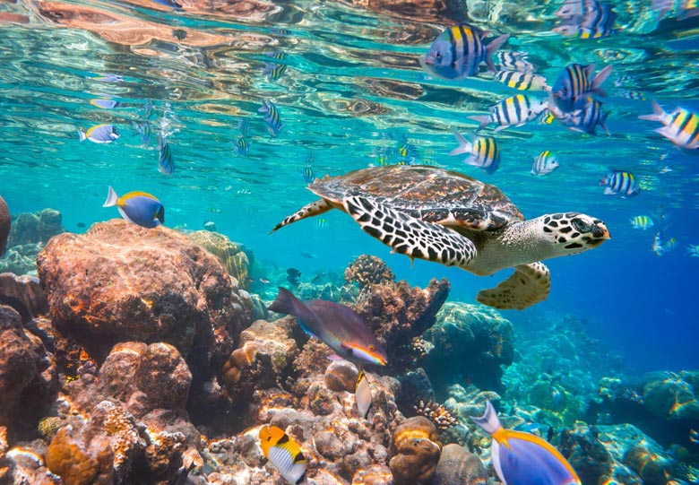

# my favorite places in nature
## why traveling ?
**Traveling**  is a very crucial part of life as it is the best way to get out of the busy schedule. It is also to experience life in different ways . Traveling is actually a good remedy for stress, anxiety and depression.

### first places to go: *New zeland*

**New Zealand** is an island nation made up of the North and South islands and a collection of smaller ones. It has a dazzling wealth of breathtaking scenery, friendly and fun-loving people, plenty of things to see and do, mouthwatering food  and a vibe that is unlike anywhere else in the world

### second place to go: *Greece*

The territory of **Greece** is largely composed of limestone, which is why many underground caves have been formed. Particularly the caves with stalactites and stalagmites are a miracle of nature. There are species of flora and fauna in the forests, caves, and gorges of **Greece**.

### third place to go: *Maldives*

**Maldives** - Nature and Wildlife. The islands that make up **Maldives** are characterised by beautiful blue oceans and amazing white sandy beaches. There are over 2,000 species of fish found in the waters surrounding the islands. There are mantra rays, stingrays and eagle rays as well as many kinds of anemones and jellyfish.
